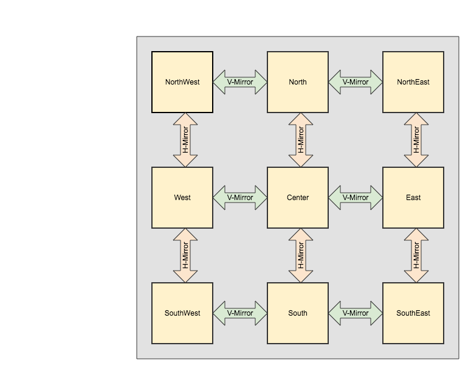

# Overview

ScrollTable gives you an easy way to create a table layout with fixed rows and or columns much like 
you are used to from programs like MS Excel or LibreOffice Calc. The width and height of each cell will be adjusted to the highest value in the row/column.
  
Additionally you can define borders for cells and separate borders between fixed and scrollable parts.

There are examples about how to implement such a behaviour for a specific example:

- https://justsimpleinfo.blogspot.de/2015/04/android-scrolling-table-with-fixed.html
- https://www.androidcode.ninja/android-scroll-table-fixed-header-column/

But to my knowledge there has not been a ready to use library component for this yet.

I hope this will be useful for someone. Feedback and questions are always welcome.

# Demos

You can define fixed columns and rows on both sides, those will be default be displayed completely. The remaining space will be filled by the scrollable center view.

[](https://www.youtube.com/watch?v=TbR2fwv5NCs)

Alternatively you can configure the fixed parts to be shrunk in order to provide more space for the center view. In this case the top and bottom portions are shrunk to fit the highest row. The left and right portions are shrunk the fit the widest column.

[](https://www.youtube.com/watch?v=D47pcqfAjLU)

# Installation

The library is available at JCenter and Maven Central. Just add the appropriate dependency to your project.

## Maven

```xml
<dependency>
  <groupId>org.butterbrot.heve.scrolltable</groupId>
  <artifactId>scrolltable</artifactId>
  <version>1.0.0</version>
  <type>pom</type>
</dependency>
```

## Gradle
```groovy
compile 'org.butterbrot.heve.scrolltable:scrolltable:1.0.0'
```
## Ivy
```xml
<dependency org='org.butterbrot.heve.scrolltable' name='scrolltable' rev='1.0.0'>
  <artifact name='scrolltable' ext='pom' ></artifact>
</dependency>
```

# Usage

To add a ScrollTable to your project I recommend to use the provided fragment class to the xml of your activity and make sure you have the res-auto namespace set accordingly.

Then in your activtiy code retrieve the reference of the ScrollTable element (e.g. findViewById) and populate it by passing View instances to it.
This can be done using the ```addRow(row: List<View> )``` method. Each call will result in a new row in ScrollTable. 

Should the length of the rows differ shorter rows will be filled with dummy cells. To override the default dummy cell implementation you can provide your own function like this: ```scrollTable.dummyView = { View(this) }```

In case you decide not to use the provided fragment or disable auto population you will also have to call ```populate()``` before the view becomes visible. To reset the table, e.g. when the content changes and you need to provide new view elements, use ```removeAllViews()```.

## Configuration Options

<dl>
    <dt>scrollTable_autoPopulate</dt>
    <dd>Defines if the fragment should handle populating the scroll table during <code>onResume</code>. Type Boolean, defaults to <code>false</code>.</dd>
    <dt>scrollTable_borderColor</dt>
    <dd>Defines color of the cell borders. Type Color, defaults to <code>Color.TRANSPARENT</code>.</dd>
    <dt>scrollTable_eastCellBorder</dt>
    <dd>Defines the east/right border width of all cells. Type Integer, defaults to <code>0</code>.</dd>
    <dt>scrollTable_eastColumns</dt>
    <dd>Defines the amount of columns on the east/right edge. Type Integer, defaults to <code>0</code>.</dd>
    <dt>scrollTable_eastColumnsGap</dt>
    <dd>Defines the width of the gap between the east/right edge and the center table. Type Integer, defaults to <code>0</code>.</dd>
    <dt>scrollTable_gapColor</dt>
    <dd>Defines the color of the gaps between north/east/south/west and the center view. Type Color, defaults to <code>Color.TRANSPARENT</code></dd>
    <dt>scrollTable_northCellBorder</dt>
    <dd>Defines the north/top border width of all cells. Type Integer, defaults to <code>0</code>.</dd>
    <dt>scrollTable_northRows</dt>
    <dd>Defines the amount of rows at the north/top edge. Type Integer, defaults to <code>0</code>.</dd>
    <dt>scrollTable_northRowsGap</dt>
    <dd>Defines the width of the gap between the north/top edge and the center table. Type Integer, defaults to <code>0</code>.</dd>
    <dt>scrollTable_shrink</dt>
    <dd>Defines which edges should be shrunk. Possible values are <code>none|north|east|south|west|all</code> which can be combined using the <code>|</code> operator, defaults to <code>none</code>.</dd>
    <dt>scrollTable_southCellBorder</dt>
    <dd>Defines the south/bottom border width of all cells. Type Integer, defaults to <code>0</code>.</dd>
    <dt>scrollTable_southRows</dt>
    <dd>Defines the amount of rows at the south/bottom edge. Type Integer, defaults to <code>0</code>.</dd>
    <dt>scrollTable_southRowsGap</dt>
    <dd>Defines the width of the gap between the south/bottom edge and the center table. Type Integer, defaults to <code>0</code>.</dd>
    <dt>scrollTable_westCellBorder</dt>
    <dd>Defines the west/left border width of all cells. Type Integer, defaults to <code>0</code>.</dd>
    <dt>scrollTable_westColumns</dt>
    <dd>Defines the amount of columns on the west/left edge. Type Integer, defaults to <code>0</code>.</dd>
    <dt>scrollTable_westColumnsGap</dt>
    <dd>Defines the width of the gap between the west/left edge and the center table. Type Integer, defaults to <code>0</code>.</dd>
</dl>

# Example 

```xml
<android.support.constraint.ConstraintLayout xmlns:android="http://schemas.android.com/apk/res/android"
    xmlns:app="http://schemas.android.com/apk/res-auto">
...
    <fragment class="org.butterbrot.heve.scrolltable.ScrollTableFragment"
        android:id="@+id/scrollTable"
        android:layout_width="wrap_content"
        android:layout_height="wrap_content"
        app:scrollTable_borderColor="@color/colorAccent"
        app:scrollTable_eastCellBorder="2"
        app:scrollTable_eastColumns="2"
        app:scrollTable_eastColumnsGap="10"
        app:scrollTable_gapColor="@color/colorPrimaryDark"
        app:scrollTable_northCellBorder="2"
        app:scrollTable_northRows="2"
        app:scrollTable_northRowsGap="10"
        app:scrollTable_shrink="all"
        app:scrollTable_southCellBorder="2"
        app:scrollTable_southRows="2"
        app:scrollTable_southRowsGap="10"
        app:scrollTable_westCellBorder="2"
        app:scrollTable_westColumns="2"
        app:scrollTable_westColumnsGap="10">
    </fragment>
</android.support.constraint.ConstraintLayout>
```

# Technical Details

## Why no ListAdapters/RecyclerViews?
RecyclerViews and Adapters would be much better in terms of memory consumption as opposed to creating all views before hand as is required at the moment.

To properly adjust the cell dimensions the ScrollTable has to measure all cells beforehand. Otherwise if a larger cell comes into view the layout would break or would need adjustment resulting in a clunky user experience.

It would be possible to have all cells to be created once, measured and then discarded when the contents are added but then you would have to settle for one view class to be used in the table.

That could be mitigated by not simply passing view content like text but instead builder functions that ScrollTable could invoke to obtain the desired view. 
 
All this would make the view more complex, not only to use but also internally. Especially the required nested RecyclerViews would complicate things. So for now I decided to keep it simple. In case there is demand for a RecyclerView implementation I will look into it.
  
## How does it actually work?

A ScrollTable object actually consists of nine tables in a 3x3 grid.



Each table is wrapped in a horizontal and a vertical scroll view. The scroll views are linked to each other. This is achieved by custom subclasses of ```ScrollView``` and ```HorizontalScrollView``` called ```MirrorScrollView``` and ```MirrorHScrollView``` in the ```org.butterbrot.heve.scrolltable``` package.

Mirror scroll views apply their scroll events to the linked scroll views to keep them in sync. Those classes can also be used separately like this:
 
```xml

            <org.butterbrot.heve.scrolltable.MirrorHScrollView
                android:id="@+id/northWestHScroll"
                android:layout_width="wrap_content"
                android:layout_height="wrap_content"
                scrolltable:mirror_horizontal="westHScroll, southWestHScroll">

                <org.butterbrot.heve.scrolltable.MirrorScrollView
                    android:id="@+id/northWestVScroll"
                    android:layout_width="wrap_content"
                    android:layout_height="wrap_content"
                    scrolltable:mirror_vertical="northVScroll, northEastVScroll">

                    <TableLayout
                        android:id="@+id/northWest"
                        android:layout_width="wrap_content"
                        android:layout_height="wrap_content" />
                </org.butterbrot.heve.scrolltable.MirrorScrollView>
            </org.butterbrot.heve.scrolltable.MirrorHScrollView>
```

The attributes ```mirror_horizontal``` and ```mirror_vertical``` accept a string containing a comma separated list of id values. Those values are used to lookup the components with the respective id in the layout. Note that a chain of mirror views does not work if one of them is empty.
